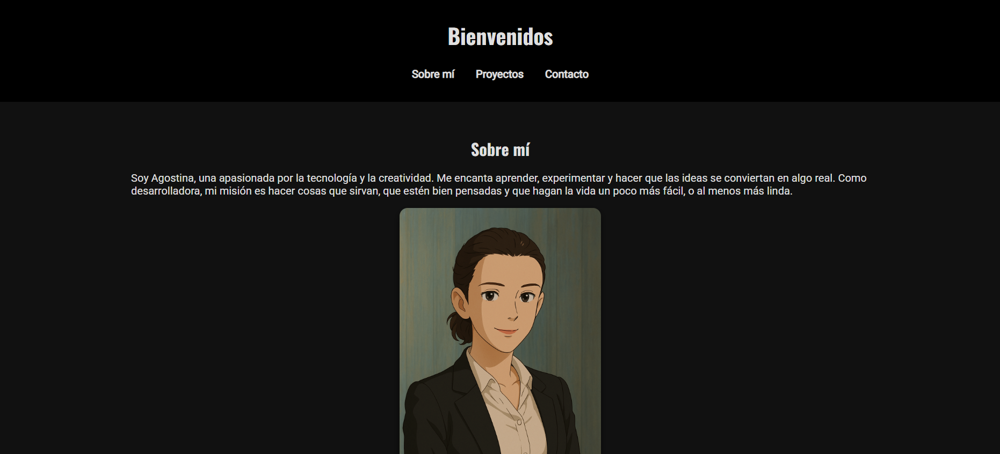
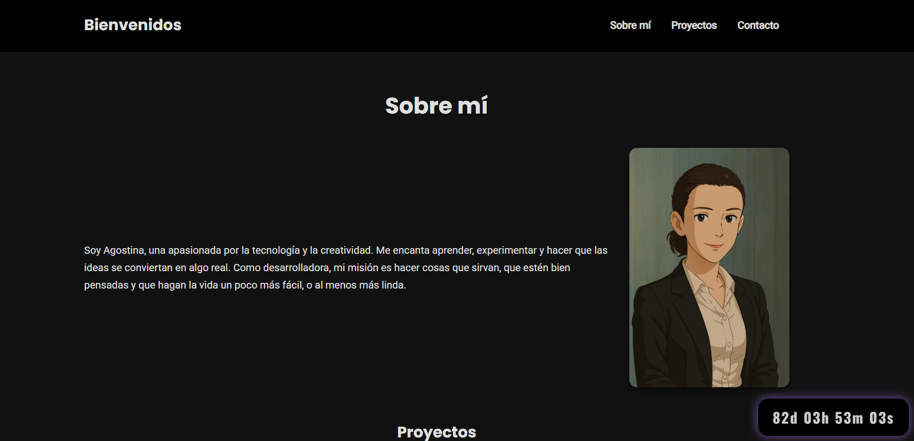

Cambios implementados al momento: 

- Se dejó fija la barra de mavegacion, se cambio su background a transparente de manera que pueda verse la primer modificacion con javascript: al deslizar hacia abajo, se vuelve negra semitransparente con una sombra sutil para destacar.

- Se agrego un countdown que marca cuando finaliza la cursada de esta materia con dias, horas y minutos. 

- Se agrego un contador de visitas al sitio, sin el enlace correspondiente a la parte backend  

- Modifique la navbar para que al achicar la pantalla aparezca como menu hamburguesa, mejorado la experiencia de usuario 

- Modifique el tamaño de la imagen principal, y cambie de lugar el texto para que se visualice al lado de la imagen, dando una version más agradable a la vista 

- Se agrego una nueva fuente para los titulos 

- Mejora de la estructura del codigo CSS: se separaron los estulos en secciones para mejor legibilidad y facilidad en la edicion

- Las capturas de pantalla del sitio antes y después de los cambios se encuentran en la carpeta img:

    Antes: img/sitio-antes.png

    Después: img/sitio-despues.png

### Vista antes de los cambios

### Vista después de los cambios

Aclaracion importante: durante el desarrollo el menú hamburguesa funcionaba correctamente en modo responsive, pero al hacer algunos ajustes de último momento, dejó de desplegarse y no logré corregirlo a tiempo para la entrega. Estoy al tanto del problema y voy a seguir trabajando para solucionarlo.